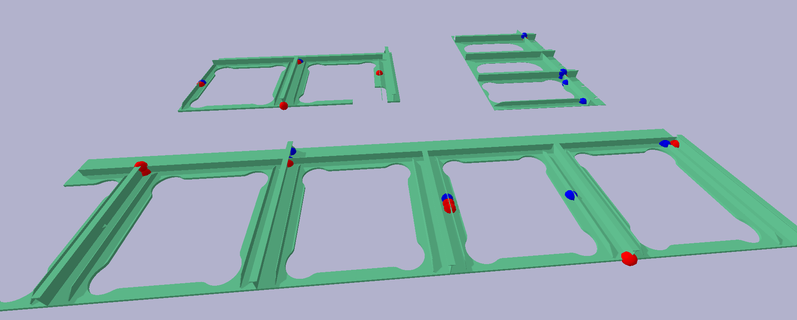

# How to run the script
Deps in `requirements.txt` for virt env or `pyproject.toml` for Poetry.

```bash
python scripts/mapping_full.py
```

Object in test is `201910204483`, can be found under `components` folder.

The Schweisspunkt in test is `PgmDef_0_0, head: MRW510_10GH`.

- The database consisted of csv files which holds 1024 ray's hit data, are stored under `NAHT_DIR`.

- The script will go through the test object, shoot the LiDAR beams 360 degree around each Schweisspunkt and record the hit/not-hit in csv file.

- The script takes the test Schweisspunkt data, rename it to `to_predict_Punkt.csv`.

- Read hit data in the test file, and compare with all files in the DB folder. This _comparison_ contains multiple evaluation methods.

- Finally, these scoring will be written in file `result_predict.csv`.

After the first run, comment out these lines to reduce time run:

```python
setup_pb()
#
generate_db_for_obj(
    obj_dir=TEST_OBJ, target_dir=NAHT_DIR, 
    num_ray=32, ray_len=20, miss_faction=-20, draw_breams=False
)
```

To add your evaluation/prediction/scoring method, add here:

```python
pred_methods = ["L2_Norm", "Test_method", "your_method_name_goes_here"]

for naht_file in list_naht_csv_file:
    # Test method
    pred_score_for_methods["Test_method"] = "test_" + str(random.random())
    # TODO: More methods ...
    # pred_score_for_methods is the dict that holds the score for each method.
    # Keys are the same as in pred_methods array.

    # Add result object
    res_dist.append(pred_score_for_methods)
```


After test a welding point against all the welding point in the object, 
run the visualization script to see how they located on the object:

```
python scripts/visualize_predicted_welding_spot.py
```

<figure>
  
  <figcaption>Red and blue represented 2 prediction methods</figcaption>
</figure>
